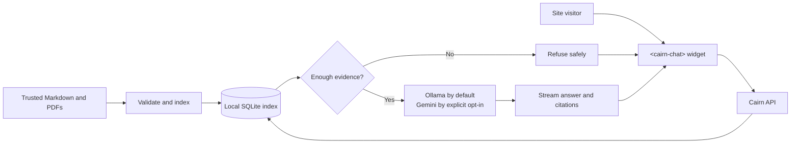

# Cairn

[](https://github.com/MichaelWeed/cairn-open-source-chat/actions/workflows/validate.yml)

**Open-source support chat that answers from your documents, shows its sources,
and refuses to guess.**

Cairn gives teams a self-hosted alternative to opaque support bots. Bring the
Markdown and PDF documents you trust, embed the chat widget in your site, and keep
the service and its data in infrastructure you control. The default path uses
local Ollama models; an optional Gemini generation adapter is available only when
an operator explicitly enables it.

Cairn is free under Apache 2.0. It is source-only software, not a hosted service.

## Why Cairn

| Principle | What it means |
| --- | --- |
| Grounded answers | Relevant document passages support each answer. |
| Visible citations | Visitors can inspect the sources behind a response. |
| Honest refusal | If the available evidence is too weak, Cairn does not invent an answer. |
| Operator-owned | You choose the models, documents, infrastructure, and data boundary. |
| Embeddable | A framework-independent `<cairn-chat>` web component fits into an existing site. |

## How it works



The citation list and model context come from the same eligible evidence. Chat
content is not persisted by the server, and retrieved documents are treated as
untrusted data rather than instructions.

## What ships today

- A FastAPI backend with a frozen JSON and server-sent-events chat contract.
- A local SQLite flat-vector index and versioned document provenance.
- Markdown and PDF ingestion, retrieval, refusal, and cited answers.
- Ollama generation and embeddings by default, plus opt-in Gemini generation.
- A responsive, accessible, shadow-DOM web component and a local demo page.
- Evaluation, security, privacy, compatibility, release, and supply-chain checks.

Cairn 0.1.0 is a developer preview for one operator-owned instance. It does not
include a hosted Cairn service, multi-tenancy, an admin console, built-in CRM or
order-status integrations, or production certification.

## Try the developer preview

Install `uv` and Ollama, make sure the default models are available, then run:

```sh
ollama pull llama3.1:8b-instruct
ollama pull nomic-embed-text
make demo
```

Open `http://localhost:8080/demo` and ask about shipping, returns, or warranties.
The command checks prerequisites and never downloads models on your behalf.

## Choose your path

- **Build or extend Cairn:** [DEVELOPER_README.md](DEVELOPER_README.md)
- **Understand the architecture:** [docs/ARCHITECTURE.md](docs/ARCHITECTURE.md) and [architecture decisions](docs/adr/)
- **Operate the source release:** [docs/RELEASE.md](docs/RELEASE.md)
- **Embed the widget:** [docs/WIDGET.md](docs/WIDGET.md)
- **Prepare a cited corpus:** [docs/CORPUS-PROVENANCE.md](docs/CORPUS-PROVENANCE.md)
- **Check compatibility:** [docs/COMPATIBILITY.md](docs/COMPATIBILITY.md)
- **Review security and privacy:** [docs/SECURITY.md](docs/SECURITY.md) and [docs/PRIVACY.md](docs/PRIVACY.md)
- **Contribute:** [docs/CONTRIBUTING.md](docs/CONTRIBUTING.md)

Built and maintained by [Michael Weed](https://github.com/MichaelWeed). See the
[Apache-2.0 license](LICENSE).
